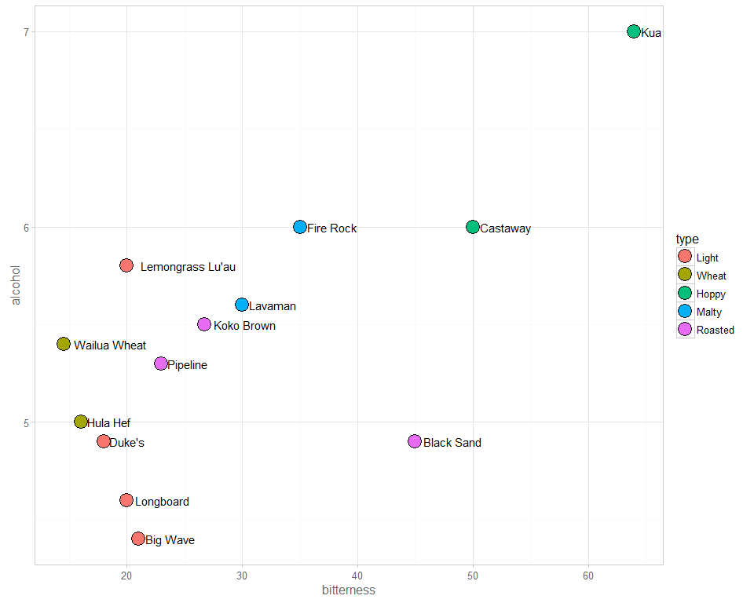
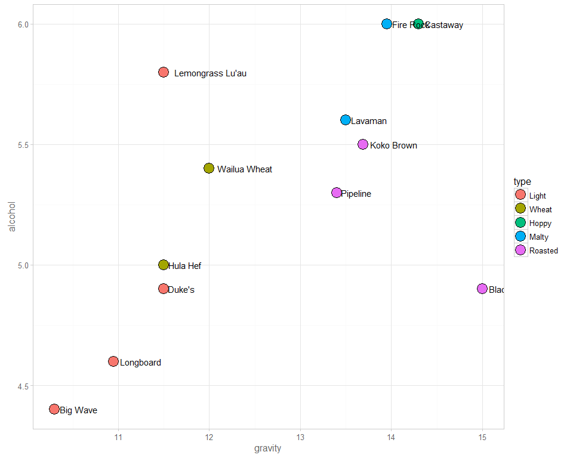

# Kona Beer


<!--  Set the working directory to the repository's base directory; this assumes the report is nested inside of two directories.-->


<!-- Set the report-wide options, and point to the external code file. -->


<!-- Load the sources.  Suppress the output when loading sources. --> 

```
Warning: package 'ggplot2' was built under R version 3.2.3
```

<!-- Load 'sourced' R files.  Suppress the output when loading packages. --> 


<!-- Load any global functions and variables declared in the R file.  Suppress the output. --> 


<!-- Declare any global functions specific to a Rmd output.  Suppress the output. --> 


<!-- Load the datasets.   -->


<!-- Tweak the datasets.   -->

See [html version](./kona-beer.html)

## Data
The data for each beer were collected from the official Kona Brewery [website](http://konabrewingco.com/). 


```
               beer           brew    type bitterness alcohol gravity
1            Duke's      Blond Ale   Light       18.0     4.9   11.50
2          Hula Hef     Hefeweisen   Wheat       16.0     5.0   11.50
3        Koko Brown      Brown Ale Roasted       26.7     5.5   13.69
4        Black Sand         Porter Roasted       45.0     4.9   15.00
5           Lavaman        Red Ale   Malty       30.0     5.6   13.50
6          Pipeline         Porter Roasted       23.0     5.3   13.40
7         Longboard          Lager   Light       20.0     4.6   10.95
8          Big Wave     Golden Ale   Light       21.0     4.4   10.30
9          Castaway India Pale Ale   Hoppy       50.0     6.0   14.30
10        Fire Rock       Pale Ale   Malty       35.0     6.0   13.95
11     Wailua Wheat     Golden Ale   Wheat       14.5     5.4   12.00
12 Lemongrass Lu'au      Blond Ale   Light       20.0     5.8   11.50
13          Kua Bay India Pale Ale   Hoppy       64.0     7.0      NA
```


##1
 

##2
Keep in mind that alcohol (ABV - alcohol by volume) and gravity (original gravity) are higly correlated

 

```
[1] 0.5751716
```


# Session Information
For the sake of documentation and reproducibility, the current report was rendered on a system using the following software.


```
Report rendered by koval_000 at 2016-01-10, 09:09 -0800
```

```
R version 3.2.2 (2015-08-14)
Platform: x86_64-w64-mingw32/x64 (64-bit)
Running under: Windows 8 x64 (build 9200)

locale:
[1] LC_COLLATE=English_United States.1252  LC_CTYPE=English_United States.1252    LC_MONETARY=English_United States.1252
[4] LC_NUMERIC=C                           LC_TIME=English_United States.1252    

attached base packages:
[1] grid      stats     graphics  grDevices utils     datasets  methods   base     

other attached packages:
[1] magrittr_1.5       RColorBrewer_1.1-2 dichromat_2.0-0    ggplot2_2.0.0      extrafont_0.17     knitr_1.10.5      

loaded via a namespace (and not attached):
 [1] Rcpp_0.11.6      Rttf2pt1_1.3.3   testit_0.4       munsell_0.4.2    colorspace_1.2-6 stringr_1.0.0   
 [7] plyr_1.8.3       dplyr_0.4.1      tools_3.2.2      parallel_3.2.2   gtable_0.1.2     DBI_0.3.1       
[13] extrafontdb_1.0  htmltools_0.2.6  yaml_2.1.13      digest_0.6.8     assertthat_0.1   formatR_1.2     
[19] evaluate_0.7     rmarkdown_0.7    labeling_0.3     stringi_0.4-1    scales_0.3.0    
```
